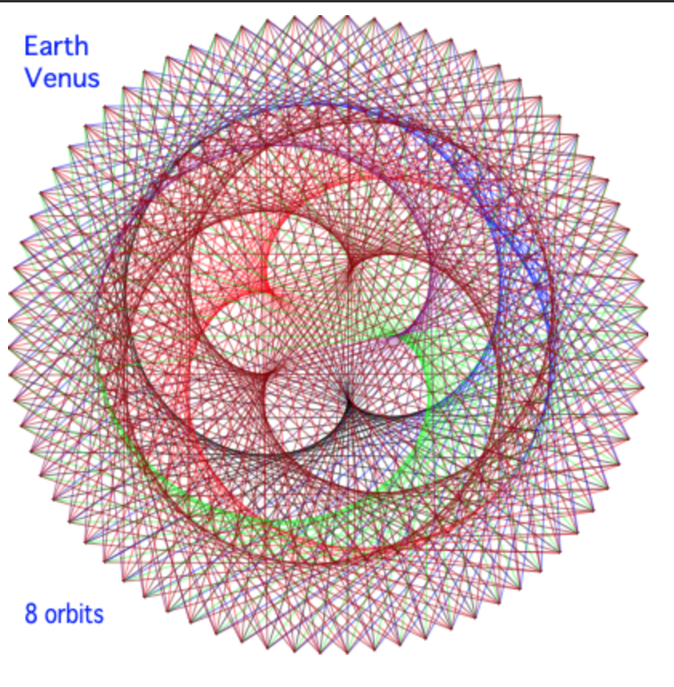

# Ported "The dance of the planets"    

A sample code ported ["The dance of the plantes"](https://web.archive.org/web/20140122124421/http:/ensign.editme.com/t43dances) to OCaml, BuckleScript and other languages

## HTML

* BuckleScript [bs](./bs)
    * Canvas2d
* [svgjs bucklescript](https://github.com/mamewotoko/bs-svgjs)
* [Scala.js](./scalajs)
    * scala-js-dom
* [Kotlin/JS](./kotlinjs)
* [three.js](./threejs)
    * 3D

## GUI

* OCaml graphics [ocaml](./ocaml)
* OCaml lalbltk [labltk](./labltk)
* OCaml lalblgtk [lablgtk](./lablgtk)
* [Java](./java)
* [C#](./csharp)
* [Ruby 2D](./ruby2d)
* [gauche scheme](./gauche-scheme)
* [SCRATCH](./scratch)
* [gtk-rs(rust)](./rust)

## PNG (image file)

* Haskell [haskell](./haskell)
* Python [Pillow](./python)
    * [Pillow](https://pillow.readthedocs.io/en/stable/)
* [R](./r)
* [Golang](./golang)
    * [fogleman/gg](https://github.com/fogleman/gg)

## Jupyter Notebook

* [ipycanvas](./ipycanvas)
    * [ipycanvas](https://github.com/martinRenou/ipycanvas)
    * draw to canvas in Jupyter Notebook

## Smartphone app

* [Kotlin Android](./kotlin_android)
* [Swift iOS](./ios_swift)
    * iPad, iPhone

## TODO

* add text to threejs
* animation ?
* javascript + canvas
* Reason
    * format from OCaml??
* typescript?
* Perl?
* Qt??
* Prolog??

Reference
--------------
* [ESPL: The dance of the plantes](https://web.archive.org/web/20140122124421/http:/ensign.editme.com/t43dances)

----
Takashi Masuyama < mamewotoko@gmail.com >

https://mamewo.ddo.jp/
