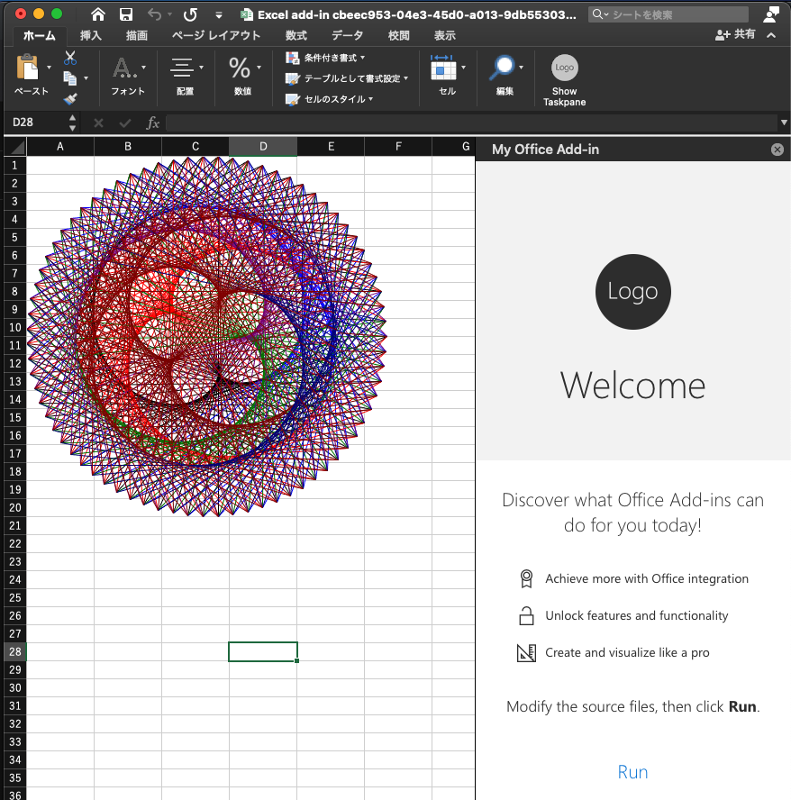

Excel add-ins: The dance of the plantes
==========================================



Setup
-----

```
cd "My Office Add-in/"
npm i
npm build
```

Run
-----

1. run

```
npm run start 
```

2. run add-in
	1. click Show Taskpane button on Home ribbon
	2. click Run lin kin right pane

Getting log on Mac
-------------------

1. enable logging

	```
	defaults write com.microsoft.Excel CEFRuntimeLoggingFile -string log.txt
	```
2. view log which is stored in the `~/Library/Containers/com.microsoft.Word/Data/` directory.

	```
	tail -f ~/library/Containers/com.microsoft.Word/Data/log.txt
	```

### Reference

* <https://docs.microsoft.com/en-us/office/dev/add-ins/testing/runtime-logging#runtime-logging-on-mac>

log is saved as text file.

Appendix: How to start Excel JavaScript Add-in Project
---------------------------------------------

1. install libraries

```
npm install -g yo generator-office
```

2. initialize project

```
$ yo office

     _-----_     ╭──────────────────────────╮
    |       |    │   Welcome to the Office  │
    |--(o)--|    │   Add-in generator, by   │
   `---------´   │ @OfficeDev! Let's create │
    ( _´U`_ )    │    a project together!   │
    /___A___\   /╰──────────────────────────╯
     |  ~  |     
   __'.___.'__   
 ´   `  |° ´ Y ` 

? Choose a project type: Office Add-in Task Pane project
? Choose a script type: JavaScript
? What do you want to name your add-in? My Office Add-in
? Which Office client application would you like to support? Excel

----------------------------------------------------------------------------------

      Creating My Office Add-in add-in for Excel using JavaScript and Taskpane at /Users/tak/dev/dance_of_the_planets/exceljs/My Office Add-in

----------------------------------------------------------------------------------
```

References
----------

* [Work with shapes using the Excel JavaScript API](https://docs.microsoft.com/en-us/office/dev/add-ins/excel/excel-add-ins-shapes)

----
Takashi Masuyama < mamewotoko@gmail.com >  
<https://mamewo.ddo.jp/>
