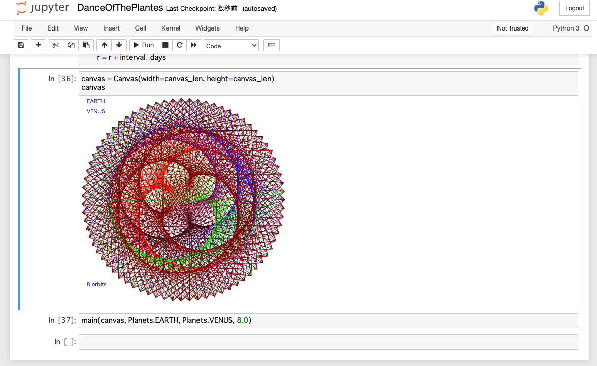

ipycanvas: Dance of the Planets
======================================

[](https://colab.research.google.com/github/mamewotoko/dance_of_the_planets/blob/master/ipycanvas/DanceOfThePlanets.ipynb)



Setup
---------
1. Install docker and docker-compose
2. Run Jupyter Notebook container

    ```
    docker-compose up -d
    ```
3. Check token to login to Jupyter Notebook

    ```
    docker-compose logs -f
    ```
2. access to Jupyter Notebook
   * Browse <http://127.0.0.1:8888/notebooks/work/DanceOfThePlantes.ipynb>
   * enter token to login
3. Run cells

--------
Takashi Masuyama < mamewotoko@gamil.com >
https://mamewo.ddo.jp/
